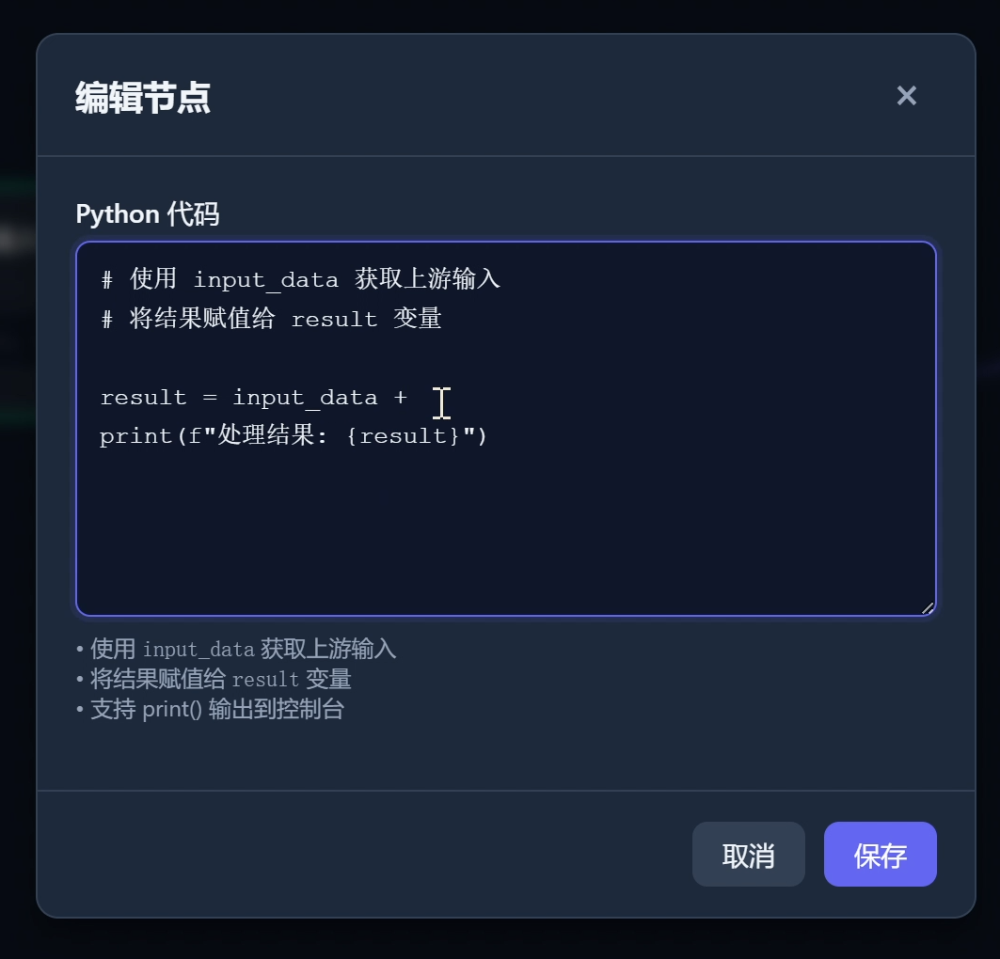
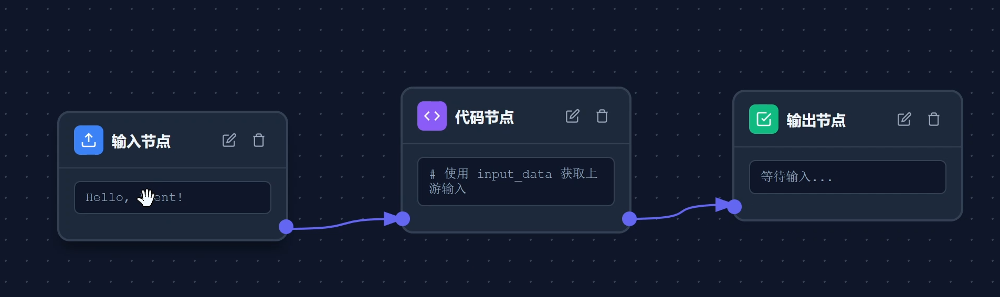

# low-code-agent

一个用于学习低代码 Agent 平台原理的 Toy 项目，模仿 Coze、Dify 等工具的核心交互方式。  
通过可视化节点拖拽和简单的 Python 代码节点，体验自定义 Agent 逻辑的基本流程。





## ✨ 当前功能

- 节点类型：**输入节点**、**输出节点**、**代码节点**
- 节点之间通过**连接线**构成数据流（当前仅支持单条固定连接线，不可删除）
- 支持**删除节点**（连接线不会被删除）
- 代码节点允许用户编写 Python 逻辑：
  - 输入数据对象为 `input_data`
  - 输出结果需赋值给 `result`
- 输出节点自动展示最终结果，无需额外配置

## 🛠 技术栈

- **后端**：Python + Flask
- **前端**：HTML5 / CSS3 / JavaScript (原生)
- （未使用额外流程图库，连接线为简单实现）

## 📦 安装与运行

1. 克隆仓库：
   ```bash
   git clone https://github.com/your-username/low-code-agent.git
   cd low-code-agent
   ```

2. 安装依赖（仅 Flask）：
   ```bash
   pip install flask
   ```

3. 启动服务：
   ```bash
   python app.py
   ```

4. 打开浏览器访问 `http://127.0.0.1:5000`

## 🧠 使用说明

### 节点操作
- 页面包含三个固定节点：**输入节点**、**代码节点**、**输出节点**。
- 只能**删除节点**（点击节点右上角的 × 按钮），删除后数据流中断。
- **连接线**不可删除、不可新增，为演示版固定连接（输入 → 代码 → 输出）。

### 代码节点编写规则
在代码节点的文本框中写入 Python 代码，必须遵循以下约定：

- 使用 `input_data` 获取上游输入节点的数据（字典格式）
- 将处理结果赋值给 `result` 变量

#### 示例代码
```python
# 将输入中的 text 字段转为大写
result = {"output": input_data.get("text", "").upper()}
```

#### 输入数据示例（来自输入节点）
```json
{
  "text": "hello agent"
}
```

#### 执行后输出节点的结果
```json
{
  "output": "HELLO AGENT"
}
```

## 🚧 当前限制（Toy 项目特性）

- 连接线拓扑固定（输入 → 代码 → 输出），不支持多分支或自定义连线
- 不支持保存/加载工作流
- 代码节点执行环境无安全隔离（仅供学习，切勿用于生产）
- 仅支持单条数据流，不能同时运行多个 Agent

## 📚 学习低代码 Agent 平台的参考路径

如果你想深入了解 Coze、Dify、LangChain 等平台的设计思想，建议按以下顺序学习：

1. **了解基础概念**  
   - Agent、Workflow、Tool、LLM 调用
2. **节点化编程模型**  
   - 研究 Drawflow、React Flow 等可视化库的实现
3. **后端执行引擎**  
   - 如何安全执行用户代码（沙箱、限制资源）
   - 如何管理异步任务、数据传递
4. **扩展功能**  
   - 条件分支、循环、变量持久化
   - 接入外部 API 或自定义工具

## 📄 License

MIT
